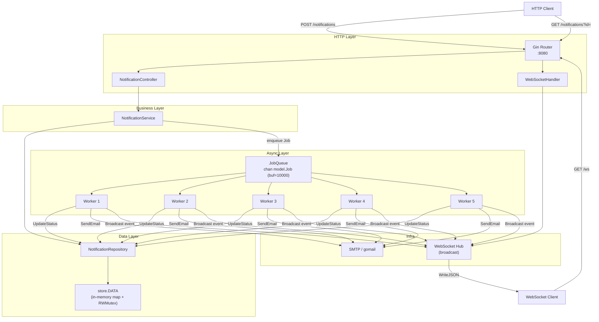
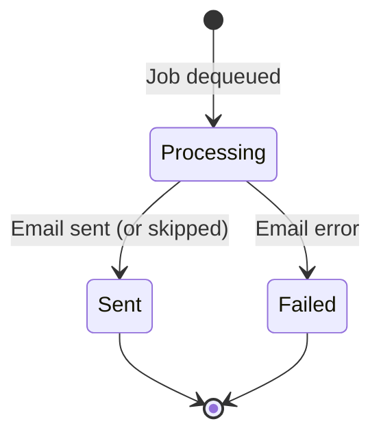
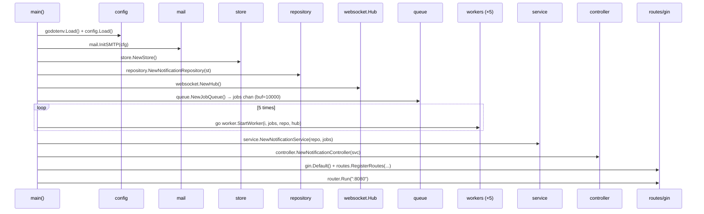
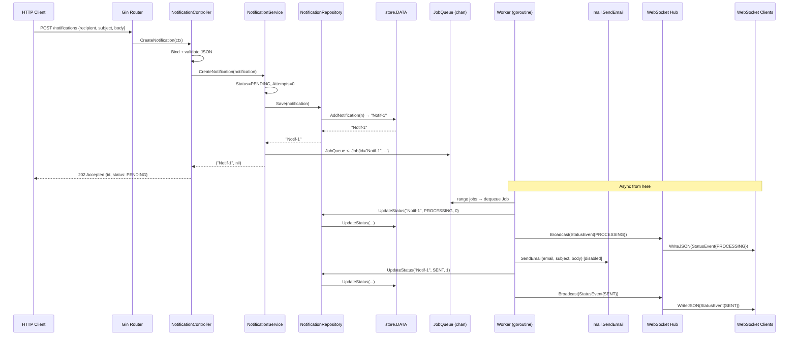
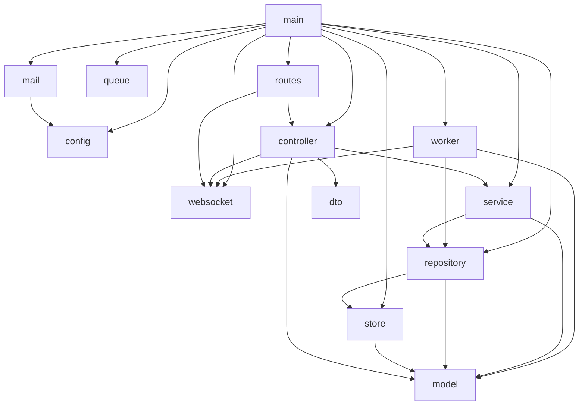

# Low-Level Design — Notification Microservice (`gonotiserv`)

## Overview

`gonotiserv` is a Go-based notification microservice that accepts notification requests via HTTP, persists them in an in-memory store, queues them for asynchronous processing by a worker pool, dispatches emails via SMTP, and pushes real-time status updates to connected clients over WebSocket.

---

## System Architecture



---

## Package Breakdown

### 1. `config` — Environment Configuration

**File:** [env_config.go](file:///c:/Users/mayank/Desktop/All%20Folders/notification_microservcie/config/env_config.go)

```
type ENV struct {
    SMTPHost     string   // SMTP_HOST env var
    SMTPPort     string   // SMTP_PORT env var
    SMTPEmail    string   // SMTP_EMAIL env var (sender address)
    SMTPPassword string   // SMTP_PASSWORD env var
}
```

| Method | Signature | Description |
|--------|-----------|-------------|
| `Load` | `() (*ENV, error)` | Reads env vars via `os.Getenv`, returns error if `SMTP_HOST` is empty |

**Notes:** Loaded once at startup via `godotenv.Load()` before `config.Load()` is called.

---

### 2. `model` — Domain Models

**File:** [notifcation.go](file:///c:/Users/mayank/Desktop/All%20Folders/notification_microservcie/model/notifcation.go)

```
type Notification struct {
    ID          string     `json:"id"`
    Channel     string     `json:"channel"`
    Recipient   string     `json:"recipient"`
    Subject     string     `json:"subject"`
    Body        string     `json:"body"`
    Status      string     `json:"status"`     // PENDING | PROCESSING | SENT | FAILED | SCHEDULED
    Attempts    int        `json:"attempts"`
    ScheduledAt *time.Time `json:"scheduled_at,omitempty"`
    CreatedAt   time.Time  `json:"created_at"`
    UpdatedAt   time.Time  `json:"updated_at"`
}

// Status constants
const (
    Pending    = "PENDING"
    Processing = "PROCESSING"
    Sent       = "SENT"
    Failed     = "FAILED"
    Scheduled  = "SCHEDULED"
)
```

**File:** [job.go](file:///c:/Users/mayank/Desktop/All%20Folders/notification_microservcie/model/job.go)

```
type Job struct {
    NotificationID string   // FK → Notification.ID
    Email          string   // Recipient email
    Subject        string
    Body           string
    RetryCount     int      // Number of previous attempts
}
```

**File:** [statusevent.go](file:///c:/Users/mayank/Desktop/All%20Folders/notification_microservcie/model/statusevent.go)

```
type NotificationStatusEvent struct {
    NotificationID string `json:"notification_id"`
    Status         string `json:"status"`
    Attempts       int    `json:"attempts"`
}
```
> Used as the WebSocket broadcast payload whenever a worker changes a notification's status.

---

### 3. `dto` — Data Transfer Objects

**File:** [notification_request.go](file:///c:/Users/mayank/Desktop/All%20Folders/notification_microservcie/dto/notification_request.go)

```
type CreateNotificationRequest struct {
    Recipient string `json:"recipient" binding:"required,email"`
    Subject   string `json:"subject"   binding:"required"`
    Body      string `json:"body"      binding:"required"`
}
```

**File:** [notification_response.go](file:///c:/Users/mayank/Desktop\All%20Folders/notification_microservcie/dto/notification_response.go)

```
type CreateNotificationResponse struct {
    ID      string `json:"id"`
    Status  string `json:"status"`   // Always "PENDING" on creation
    Message string `json:"message"`  // "notification queued successfully"
}
```

---

### 4. `store` — In-Memory Data Store

**File:** [store.go](file:///c:/Users/mayank/Desktop/All%20Folders/notification_microservcie/store/store.go)

```
type DATA struct {
    mu            sync.RWMutex
    count         int                          // auto-increment ID counter
    notifications map[string]*model.Notification
}
```

| Method | Signature | Concurrency | Description |
|--------|-----------|-------------|-------------|
| `NewStore` | `() *DATA` | — | Initializes empty store |
| `AddNotification` | `(n *model.Notification) string` | **Write Lock** | Assigns ID `Notif-{count}`, sets timestamps, stores pointer |
| `GetNotification` | `(id string) *model.Notification` | **Read Lock** | Returns pointer or nil |
| `UpdateStatus` | `(id, status string, attempts int) error` | **Write Lock** | Mutates Status, Attempts, UpdatedAt in-place |
| `GetAllNotifications` | `(email string) []*model.Notification` | **Read Lock** | Filters by `Recipient == email` |
| `DeleteNotification` | `(id string) error` | **Write Lock** | Removes from map |

**ID Format:** `Notif-1`, `Notif-2`, … (sequential, integer-backed)

**Thread Safety:** All operations protected by `sync.RWMutex`. Reads use `RLock`, writes use `Lock`.

---

### 5. `repository` — Repository Layer

**File:** [notification_repository.go](file:///c:/Users/mayank/Desktop/All%20Folders/notification_microservcie/repository/notification_repository.go)

```
type NotificationRepository struct {
    store *store.DATA
}
```

Acts as a thin adapter over `store.DATA`, providing a domain-oriented API:

| Method | Signature | Delegates To |
|--------|-----------|--------------|
| `NewNotificationRepository` | `(store *store.DATA) *NotificationRepository` | — |
| `Save` | `(n *model.Notification) string` | `store.AddNotification` |
| `GetByID` | `(id string) (*model.Notification, error)` | `store.GetNotification` + nil check |
| `UpdateStatus` | `(id, status string, attempts int) error` | `store.UpdateStatus` |
| `GetAll` | `(email string) []*model.Notification` | `store.GetAllNotifications` |
| `Delete` | `(id string) error` | `store.DeleteNotification` |

**Design Note:** The repository wraps the nil return from `GetNotification` into a typed `error`, providing a cleaner contract for consumers.

---

### 6. `queue` — Job Queue

**File:** [jobqueue.go](file:///c:/Users/mayank/Desktop/All%20Folders/notification_microservcie/queue/jobqueue.go)

```go
func NewJobQueue() chan model.Job {
    return make(chan model.Job, 10000)
}
```

| Property | Value |
|----------|-------|
| Type | Buffered Go channel |
| Element | `model.Job` |
| Buffer Size | **10,000** jobs |
| Direction (producer) | `chan<- model.Job` (send-only, in service) |
| Direction (consumer) | `<-chan model.Job` (receive-only, in worker) |

**Backpressure:** If the buffer fills (>10,000 unprocessed jobs), `service.CreateNotification` will block until a worker drains a slot. No overflow/drop strategy is currently implemented.

---

### 7. `service` — Business Logic

**File:** [notification_service.go](file:///c:/Users/mayank/Desktop/All%20Folders/notification_microservcie/service/notification_service.go)

```
type NotificationService struct {
    repo     *repository.NotificationRepository
    jobQueue chan<- model.Job   // send-only reference to the shared channel
}
```

| Method | Signature | Description |
|--------|-----------|-------------|
| `NewNotificationService` | `(repo, jobQueue) *NotificationService` | Constructor |
| `CreateNotification` | `(n *model.Notification) (string, error)` | Sets `Status=PENDING`, `Attempts=0`, saves via repo, enqueues `Job` |
| `GetNotification` | `(id string) (*model.Notification, error)` | Direct repo lookup |
| `GetAllNotifications` | `(email string) []*model.Notification` | Filters by recipient |
| `DeleteNotification` | `(id string) error` | Removes via repo |

**CreateNotification Flow:**
```
1. n.Status = "PENDING", n.Attempts = 0, set timestamps
2. id = repo.Save(n)              ← synchronous, assigns ID
3. jobQueue <- Job{id, email, ...} ← may block if queue full
4. return id, nil
```

---

### 8. `mail` — SMTP Email Sender

**File:** [mail.go](file:///c:/Users/mayank/Desktop/All%20Folders/notification_microservcie/mail/mail.go)

```
// Package-level globals (singleton pattern)
var (
    sender gomail.SendCloser   // persistent SMTP connection
    mu     sync.Mutex          // guards sender for concurrent Send calls
    cfg    *config.ENV
)
```

| Function | Signature | Description |
|----------|-----------|-------------|
| `InitSMTP` | `(c *config.ENV) error` | Dials SMTP on port 587, stores `SendCloser` globally |
| `SendEmail` | `(to, subject, body string) error` | Builds HTML message, acquires mutex, sends via shared connection |
| `CloseSMTP` | `() error` | Closes the persistent connection (deferred in `main`) |

**Concurrency Note:** All 5 workers may call `SendEmail` concurrently. The `sync.Mutex` serializes access to the shared `sender` connection.

> ⚠️ **Current Status:** `mail.SendEmail` is commented out in `worker.go`. Workers currently only update status to `SENT` without actually dispatching emails.

---

### 9. `websocket` — Real-Time Push

**File:** [hub.go](file:///c:/Users/mayank/Desktop/All%20Folders/notification_microservcie/websocket/hub.go)

```
type Hub struct {
    Clients map[*websocket.Conn]bool
    Mu      sync.RWMutex
}
```

| Method | Signature | Concurrency | Description |
|--------|-----------|-------------|-------------|
| `NewHub` | `() *Hub` | — | Creates Hub with empty client map |
| `Broadcast` | `(msg any)` | **Read Lock** | Iterates all connected clients and calls `conn.WriteJSON(msg)` |

**File:** [client.go](file:///c:/Users/mayank/Desktop/All%20Folders/notification_microservcie/websocket/client.go)

```
type Client struct {
    Conn *gws.Conn
    Send chan any   // currently unused — broadcast is done directly via Hub
}
```

**Connection Lifecycle (managed in `ws_controller.go`):**
```
1. Upgrade HTTP → WebSocket (Gorilla upgrader, all origins allowed)
2. hub.Mu.Lock() → hub.Clients[conn] = true → hub.Mu.Unlock()
3. Block on conn.ReadMessage() loop (keeps goroutine alive)
4. On disconnect/error → remove from hub.Clients → conn.Close()
```

---

### 10. `controller` — HTTP Handlers

**File:** [notification_controller.go](file:///c:/Users/mayank/Desktop/All%20Folders/notification_microservcie/controller/notification_controller.go)

```
type NotificationController struct {
    service *service.NotificationService
}
```

| Handler | Method | Route | Request | Success Response |
|---------|--------|-------|---------|-----------------|
| `CreateNotification` | POST | `/notifications` | `CreateNotificationRequest` JSON body | `202 Accepted` + `CreateNotificationResponse` |
| `GetNotification` | GET | `/notifications?id=` | `id` query param | `200 OK` + `*model.Notification` |
| `GetAllNotification` | GET | `/notifications` | — | *(not implemented yet)* |

**File:** [ws_controller.go](file:///c:/Users/mayank/Desktop/All%20Folders/notification_microservcie/controller/ws_controller.go)

| Handler | Route | Description |
|---------|-------|-------------|
| `WebSocketHandler(hub)` | GET `/ws` | Upgrades connection, registers in Hub, blocks for lifetime of connection |

---

### 11. `routes` — Route Registration

**File:** [routes.go](file:///c:/Users/mayank/Desktop/All%20Folders/notification_microservcie/routes/routes.go)

```
GET  /ws                    → controller.WebSocketHandler(hub)

POST /notifications         → NotificationController.CreateNotification
GET  /notifications?id=     → NotificationController.GetNotification

// Pending routes (commented out):
// GET    /notifications       → GetAllNotifications
// DELETE /notifications/:id   → DeleteNotification
```

---

### 12. `worker` — Async Job Processor

**File:** [worker.go](file:///c:/Users/mayank/Desktop/All%20Folders/notification_microservcie/worker/worker.go)

```go
func StartWorker(id int, jobs <-chan model.Job, repo *repository.NotificationRepository, hub *websocket.Hub)
```

**Processing State Machine per Job:**



**Detailed Step-by-Step:**

| Step | Action | Repo Call | Hub Broadcast |
|------|--------|-----------|---------------|
| 1 | Dequeue job from channel | — | — |
| 2 | Mark as PROCESSING | `repo.UpdateStatus(id, "PROCESSING", retryCount)` | `NotificationStatusEvent{id, PROCESSING, retryCount}` |
| 3 | Send email (currently disabled) | — | — |
| 4a | On email error → mark FAILED | `repo.UpdateStatus(id, "FAILED", retryCount+1)` | `NotificationStatusEvent{id, FAILED, retryCount+1}` |
| 4b | On email success → mark SENT | `repo.UpdateStatus(id, "SENT", retryCount+1)` | `NotificationStatusEvent{id, SENT, retryCount+1}` |

**Concurrency:** 5 goroutines are spawned in `main.go`, each running `StartWorker`. All share the same `jobs` channel and `hub`, but each gets an independent `id` for logging.

---

## Startup Sequence (`main.go`)



---

## Request Lifecycle — Create Notification



---

## Data Flow Summary

```
[HTTP Request]
      │
      ▼
[dto.CreateNotificationRequest]
      │ bind + validate
      ▼
[model.Notification]  ──── Save ────►  [store.DATA map]
      │                                      ▲
      │  enqueue                             │ UpdateStatus (×2 per job)
      ▼                                      │
[queue: chan model.Job (buf=10k)]            │
      │                                      │
      ├── Worker 1 ──────────────────────────┤
      ├── Worker 2 ──────────────────────────┤
      ├── Worker 3 ──────────────────────────┤
      ├── Worker 4 ──────────────────────────┤
      └── Worker 5 ──────────────────────────┘
              │
              │  Broadcast
              ▼
        [WebSocket Hub]
              │ WriteJSON
              ▼
       [WS Clients (browser)]
```

---

## Key Design Decisions & Trade-offs

| Decision | Current Implementation | Implication |
|----------|----------------------|-------------|
| **Storage** | In-memory `map` with `sync.RWMutex` | ✅ Zero dependencies, ❌ data lost on restart, ❌ no multi-instance support |
| **Queue** | Buffered Go channel (10,000) | ✅ Simple & fast, ❌ lost on restart, ❌ no retry/DLQ |
| **Worker concurrency** | Fixed pool of 5 goroutines | ✅ Predictable, ❌ not auto-scaled |
| **SMTP connection** | Singleton persistent connection with mutex | ✅ Reuses TCP conn, ❌ single point of failure, serialized sends |
| **WebSocket broadcast** | Fan-out to all connected clients | ✅ Simple, ❌ no user-scoped filtering |
| **ID generation** | Sequential `Notif-{N}` counter | ✅ Simple, ❌ not unique across restarts or instances |
| **No retry logic** | `RetryCount` field exists but no retry loop | ❌ Failed jobs are not re-queued |
| **Email disabled** | `mail.SendEmail` is commented out in worker | ⚠️ Workers always succeed immediately |

---

## Package Dependency Graph



---

## File Index

| File | Package | Role |
|------|---------|------|
| [main.go](file:///c:/Users/mayank/Desktop/All%20Folders/notification_microservcie/main.go) | `main` | Wires all dependencies, starts server |
| [config/env_config.go](file:///c:/Users/mayank/Desktop/All%20Folders/notification_microservcie/config/env_config.go) | `config` | Env var loading |
| [model/notifcation.go](file:///c:/Users/mayank/Desktop/All%20Folders/notification_microservcie/model/notifcation.go) | `model` | Core domain struct + status constants |
| [model/job.go](file:///c:/Users/mayank/Desktop/All%20Folders/notification_microservcie/model/job.go) | `model` | Queue job payload |
| [model/statusevent.go](file:///c:/Users/mayank/Desktop/All%20Folders/notification_microservcie/model/statusevent.go) | `model` | WebSocket broadcast event |
| [dto/notification_request.go](file:///c:/Users/mayank/Desktop/All%20Folders/notification_microservcie/dto/notification_request.go) | `dto` | HTTP request schema |
| [dto/notification_response.go](file:///c:/Users/mayank/Desktop/All%20Folders/notification_microservcie/dto/notification_response.go) | `dto` | HTTP response schema |
| [store/store.go](file:///c:/Users/mayank/Desktop/All%20Folders/notification_microservcie/store/store.go) | `store` | In-memory data store |
| [repository/notification_repository.go](file:///c:/Users/mayank/Desktop/All%20Folders/notification_microservcie/repository/notification_repository.go) | `repository` | Repository pattern over store |
| [queue/jobqueue.go](file:///c:/Users/mayank/Desktop/All%20Folders/notification_microservcie/queue/jobqueue.go) | `queue` | Buffered job channel factory |
| [service/notification_service.go](file:///c:/Users/mayank/Desktop/All%20Folders/notification_microservcie/service/notification_service.go) | `service` | Business logic, orchestration |
| [controller/notification_controller.go](file:///c:/Users/mayank/Desktop/All%20Folders/notification_microservcie/controller/notification_controller.go) | `controller` | HTTP handler for notifications |
| [controller/ws_controller.go](file:///c:/Users/mayank/Desktop/All%20Folders/notification_microservcie/controller/ws_controller.go) | `controller` | WebSocket upgrade + connection mgmt |
| [worker/worker.go](file:///c:/Users/mayank/Desktop/All%20Folders/notification_microservcie/worker/worker.go) | `worker` | Async job processor goroutines |
| [websocket/hub.go](file:///c:/Users/mayank/Desktop/All%20Folders/notification_microservcie/websocket/hub.go) | `websocket` | Broadcast hub for WS clients |
| [websocket/client.go](file:///c:/Users/mayank/Desktop/All%20Folders/notification_microservcie/websocket/client.go) | `websocket` | Client struct (currently unused) |
| [routes/routes.go](file:///c:/Users/mayank/Desktop/All%20Folders/notification_microservcie/routes/routes.go) | `routes` | Gin route registration |
| [mail/mail.go](file:///c:/Users/mayank/Desktop/All%20Folders/notification_microservcie/mail/mail.go) | `mail` | SMTP connection + email dispatch |
